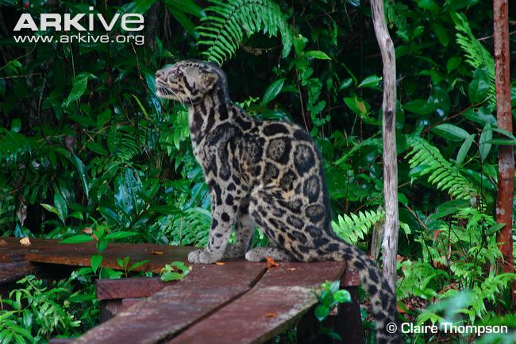
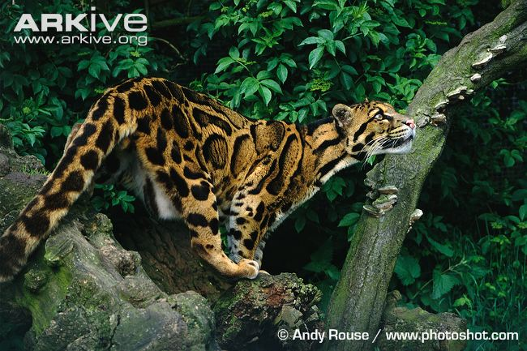
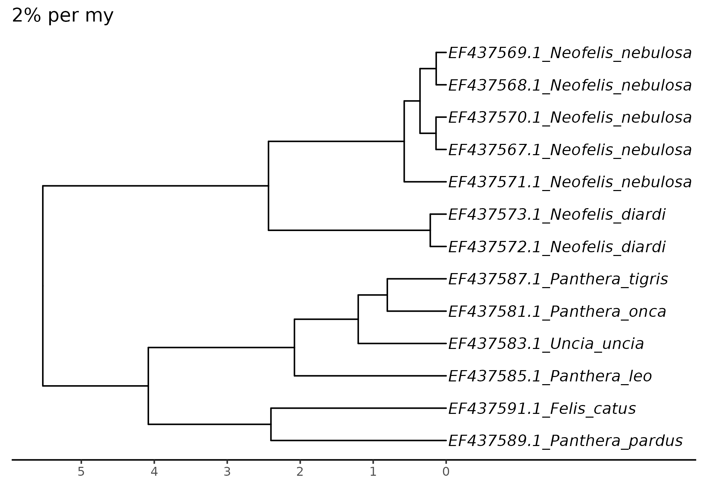
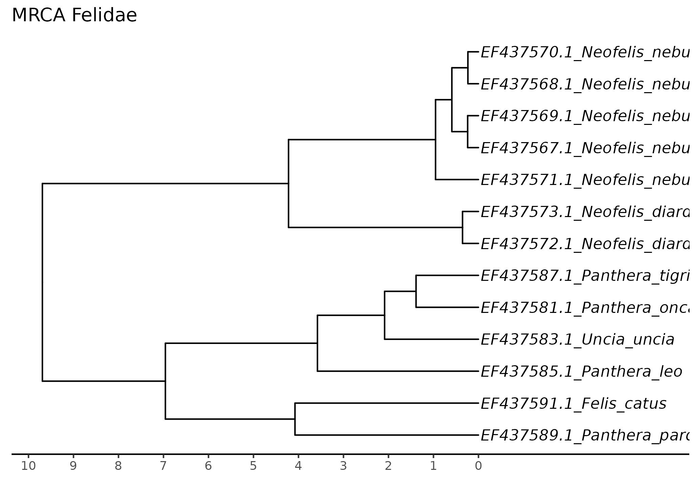
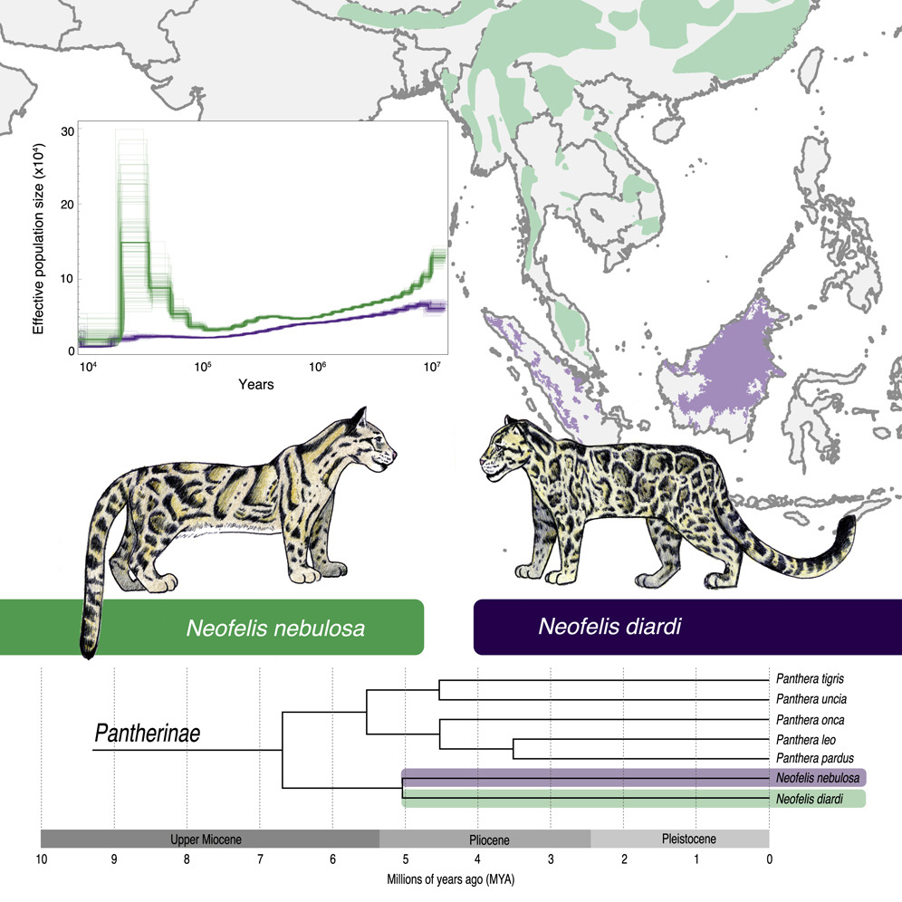
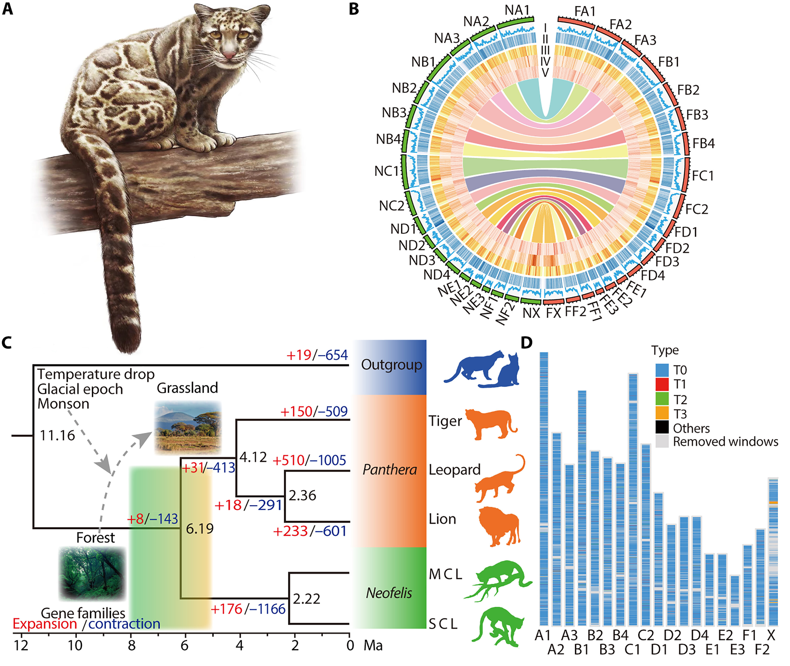

# Дымчатые леопарды

## Резюме

Дымчатые леопарды — это представители сем. Кошачьи (Felidae), которые до начала XXI века принято было объединять в несколько подвидов вида _Neofelis nebulosa_. Привлечение молекулярных данных (секвенирование коротких участков нескольких митохондриальных генов) показало, что дымчатого леопарда с о. Борнео следует выделить из вида _Neofelis nebulosa_ в отдельный вид _Neofelis diardi_, поскольку предки дымчатых леопардов с материка и островов разошлись около 1,4 млн лет назад. Впоследствии были проведены полногеномные исследования для этих видов. Авторы одного из этих исследований оценили время расхождения _N. nebulosa_ и _N. diardi_ как приблизительно 2 млн лет, а другого — как около 5 млн лет.
Цель данного микропроекта — оценить время расхождения _N. nebulosa_ и _N. diardi_ по данным секвенирования гена _ATP8_ с помощью двух подходов: по известной скорости накопления мутаций в митохондриальной ДНК млекопитающих и по палеонтологическим данным.
Проведённый анализ показал, что в зависимости от подбора настроек можно получить различные оценки в диапазоне от 2 до 4 млн лет, и они действительно совпадают с предложенными в разных статьях.
Следует отметить, что оценка по последовательности короткого фрагмента (около 100 н.п.) является приблизительной и не может являться основанием для научных выводов. Проект имеет в первую очередь учебную ценность.




Внешний вид объектов исследования. Источник фотографий: [https://www.wildcatfamily.com/panthera-lineage/sunda-clouded-leopard-neofelis-diardi/] и [https://www.wildcatfamily.com/panthera-lineage/clouded-leopard-neofelis-nebulosa/].

## Методы

Использованные программы: 
  * `efetch v14.` (пакет ncbi-entrez-direct);
  * `mafft v7.490`;
  * `trimal v1.2 rev59`;
  * `iqtree v2.0.7`;
  * `beast v2.7.6`;
  * `R v4.1.2`;
  * `ggtree v3.2.1`;
  * `treeio v1.18.1`;
  * `ggplot v3.5.0`.

Скачиваем даннные (последовательности _ATP8_):
`efetch -db popset -id 126256179 -format fasta >felidae_atp8.fa ## might not work, then go to NCBI`

Правим заголовки в fasta, чтобы потом было удобнее:
`cut -d ' ' -f 1,2,3 felidae_atp8.fa | sed -e 's/ /_/g' > felidae_atp8.renamed.fa`

Выравнивание: 
`mafft --auto felidae_atp8.renamed.fa >felidae_atp8.aln`

Обрезка выравнивания:
`trimal -in felidae_atp8.aln -out felidae_atp8.trim.fas -nogaps`

Построение дерева:
`iqtree2 -s felidae_atp8.trim.fas -o EF437591.1_Felis_catus -alrt 1000 -abayes`

Датировка:
- Настройка в beauti (GUI): загрузка выравнивания и настройка либо скорости эволюции (вкладка rate model), либо возраста группы (priors).
- Запуск beast:`beast beauti_mrca.xml` и `beast beauti_rate.xml`.
- Проверка качества сходимости в Tracer ­(GUI): в первую очередь проверяем ESS и trace для параметра tree height.
- Получение единого консенсусного дерева в treeannotator (GUI).

Строим деревья в R с помощью ggtree:
```{r}
library(ggplot2)
library(ggtree)
#if (!require("BiocManager", quietly = TRUE))
#    install.packages("BiocManager")
#BiocManager::install("treeio")

library(treeio)

felidae_mrca <- read.beast("beauti_mrca-felidae_atp8.tree")
ggtree(felidae_mrca) + 
  geom_tiplab(fontface = "italic") + 
  theme_tree2() + 
  expand_limits(x=4) +
  scale_x_continuous(labels = abs, breaks = -10:0) -> t1

revts(t1) + ggtitle("MRCA Felidae")
ggsave("tree_MRCA.png")

felidae_rate <- read.beast("beauti_rate-felidae_atp8.tree")
ggtree(felidae_rate) + 
  geom_tiplab(fontface = "italic") + 
  theme_tree2() + 
  expand_limits(x=3) +
  scale_x_continuous(labels = abs, breaks = -5:0) -> t2

revts(t2) + ggtitle("2% per my")
ggsave("tree_rate.png")
```

## Результаты и обсуждение

В результате проделанного анализа получена следующая филогения исследованных видов с датировкой по известной скорости накопления мутаций в 2%: 


Если исходить из возраста семейства кошачьи, картина получается следующей:



В оригинальных статьях результаты представлены следующим образом:




Полученные результаты принципиально повторяют результаты, полученные в исходных статьях. Интересно, что, используя фрагмент всего в 100 н.п., мы получили датировку внутри диапазона.

## Список литературы

  - Bursell MG, Dikow RB, Figueiró HV, Dudchenko O, Flanagan JP, Aiden EL, Goossens B, Nathan SK, Johnson WE, Koepfli KP, Frandsen PB. Whole genome analysis of clouded leopard species reveals an ancient divergence and distinct demographic histories. Iscience. 2022 Dec 22;25(12). [https://doi.org/10.1016/j.isci.2022.105647]
  - Yuan J, Wang G, Zhao L, Kitchener AC, Sun T, Chen W, Huang C, Wang C, Xu X, Wang J, Lu H. How genomic insights into the evolutionary history of clouded leopards inform their conservation. Science Advances. 2023 Oct 6;9(40):eadh9143. [https://doi.org/10.1126/sciadv.adh9143]
  - Buckley-Beason VA, Johnson WE, Nash WG, Stanyon R, Menninger JC, Driscoll CA, Howard J, Bush M, Page JE, Roelke ME, Stone G. Molecular evidence for species-level distinctions in clouded leopards. Current Biology. 2006 Dec 5;16(23):2371-6. [https://doi.org/10.1016/j.cub.2006.08.066]

